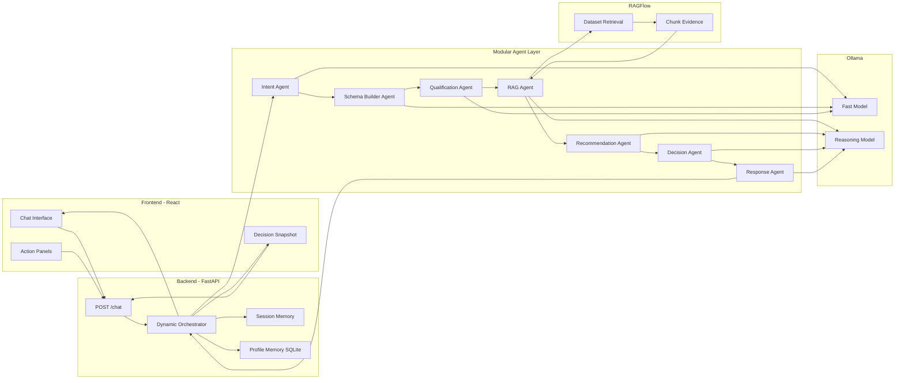

# Adaptive AI Decision Engine - Architecture

## System Diagram

## Pipeline Flow
1. User message enters the orchestrator.
2. Intent Agent returns normalized intent, domain, urgency, and confidence.
3. Schema Builder Agent produces 3 to 5 dynamic required fields for that context.
4. Qualification Agent extracts known values and asks one high-impact next question.
5. RAG Agent runs only when factual grounding is required.
6. Recommendation Agent generates strategy, options, actions, and expected impact.
7. Decision Agent outputs one admin-facing action, priority, justification, and steps.
8. Response Agent converts structured outputs into concise multilingual response.
9. Orchestrator persists profile and returns structured payload to frontend.

## Dynamic Schema Strategy
- Schema is regenerated every turn from intent + domain + known profile.
- Required fields are limited to 3 to 5 for speed and focus.
- Unknown/invalid fields are sanitized to snake_case and deduplicated.
- Existing profile values reduce missing_fields automatically.
- Dynamic field values are persisted inside profile preferences.dynamic_profile.

## Contract Validation Strategy
- Every agent returns strict JSON.
- JSON is parsed and validated against Pydantic models.
- On invalid JSON, the system retries once with a repair prompt.
- If validation still fails, stage-specific fallback JSON is used.
- Downstream agents always receive validated contracts.

## Scoring
- Lead/readiness score uses dynamic completeness + urgency + confidence + intent.
- Decision priority score combines urgency, confidence, missing data, action count, and risk count.

## Memory Model
- Session memory: interaction history for context windows.
- Long-term memory: profile + preferences in SQLite.
- Dynamic values are stored under preferences.dynamic_profile with required_fields metadata.
